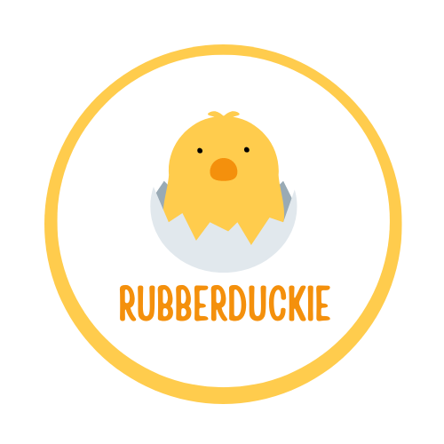

.. rubberduckie documentation master file, created by
   sphinx-quickstart on Mon Feb  9 22:00:45 2026.
   You can adapt this file completely to your liking, but it should at least
   contain the root `toctree` directive.

RubberDuckie documentation
==========================

Python library designed to make AI model development and deployment easier.

.. toctree::
   :maxdepth: 2
   :caption: Contents:

   api
